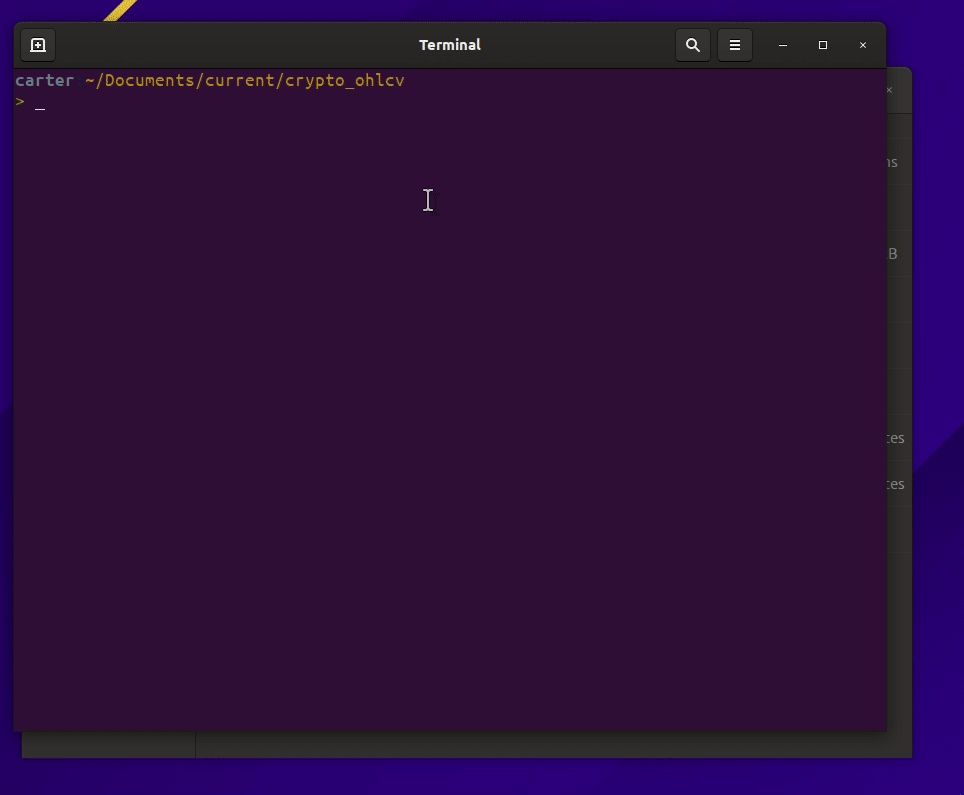

### crypto_ohlcv
#### by: Carter Carlson

##### Introduction
Looking to save historical price data on a cryptocurrency from an exchange, but
don't know how to start?  I'll save you!  All you need to have is Python (3) installed
and have used the CLI (Command Line Interface) before.

##### Steps
1. `git clone git@github.com:carlfarterson/crypto_ohlcv.git`
2. `cd crypto_ohlcv`
3. `pip install -r Requirements.txt`
4. `python main.py`

It's that easy.

Files will automatically save in the `crypto_ohlcv` folder.

